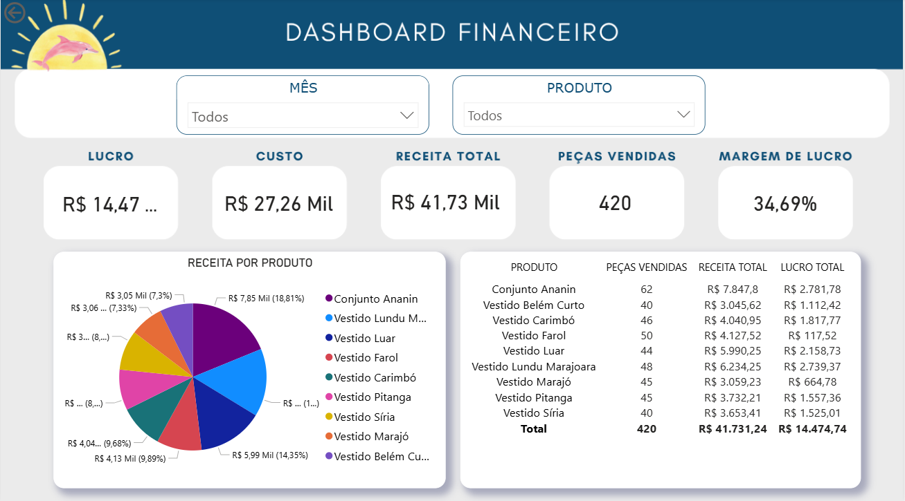

<<<<<<< HEAD
# 💼 Portfólio — Análise de Dados | Júlia Oliveira

> Projetos de análise de dados aplicados ao varejo de moda, desenvolvidos com Power BI, DAX e Excel.

## 👩‍💻 Sobre

Estudante de Engenharia de Computação com experiência prática em análise de dados, automação e visualização. Este portfólio reúne projetos reais desenvolvidos para responder perguntas de negócio com dados.

📧 julia.engcomputacao@gmail.com | 📍 Belém, PA

---

## 📁 Projetos

### [📊 Dashboard Financeiro — Power BI](./dashboard-financeiro-powerbi/)

Dashboard interativo com KPIs financeiros de uma loja de moda paraense.

- **Ferramentas:** Power BI Desktop · DAX · Power Query · Excel
- **KPIs:** Lucro, Receita, Custo, Margem de Lucro, Peças Vendidas
- **Destaque:** Filtros dinâmicos por mês e produto com medidas DAX

---

## 🛠️ Tecnologias

=======
# portfolio-dados
>>>>>>> 7da5fa2c806de50a29538be786e846c23d0d2e15
